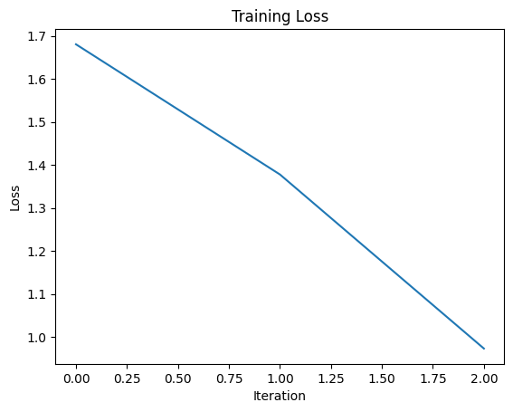
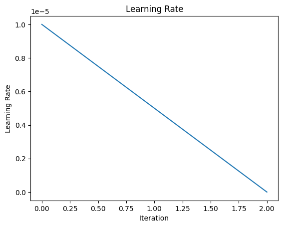

# How to Fine-tune Large Language Models

Hello everyone, today we are going to get started with Fine-tuning Large Language Models (LLMs) locally and can be used in the cloud.

## Introduction
Currently, there are two common methods to customize our LLMs.

### Prompting
- Generic, side project prototypes
  - Pros: No data required to get started, smaller upfront cost, no technical knowledge needed, connect data through retrieval (RAG)
  - Cons: Much less data fits, forgets data, hallucinations, RAG misses or gets incorrect data

### Fine-tuning
- Domain-specific, enterprise, production usage, privacy
  - Pros: Nearly unlimited data fits, learn new information, correct incorrect information, less cost if smaller model, use RAG too, reduce hallucinations
  - Cons: Need high quality data, upfront compute cost, needs technical knowledge for the data

Fine-tuning usually refers to training further. It can be done with self-supervised unlabeled data or labeled data that you curated. It requires much less data compared to fine-tuning for generative tasks, which is not well defined. Fine-tuning updates the entire model, not just a part of it.


## Environment Setup

## Local Setup
First, we are going to install our environment with Python 3.10.11. After you have installed Python in your working directory, you can create your virtual environment using the following command:

```
python -m venv .venv

```
You'll notice a new directory in your current working directory with the same name as your virtual environment. Then, activate the virtual environment:
```
.venv\Scripts\activate.bat

```

It is convenient to have the latest pip installed:

```
python -m pip install --upgrade pip

```
Next, we install Jupyter Notebook, as you can also use it:


```
pip install ipykernel notebook
```


### Step 3: Setup libraries
Once we have our running environment, we install our kernel:


```
python -m ipykernel install --user --name LLM --display-name "Python (LLM)"
```

Then, we will require PyTorch, HuggingFace, and Llama libraries:


```
pip install datasets==2.14.6 transformers==4.31.0 torch torchvision  lamini==2.0.1 ipywidgets python-dotenv sacrebleu sqlitedict omegaconf pycountry rouge_score peft pytablewriter
```

If we are on Windows, we can use the following command:
```
pip install transformers[torch] 
```
If we are on Linux, we can use the following command:
```
pip install accelerate -U
```


## Why Fine-tune All the Parameters?
- LORA (Low Rank Adaptation of LLMs)
  - Fewer trainable parameters for GPT3 (1000x less)
  - Less GPU memory usage
  - Slightly lower accuracy compared to fine-tuning
  - Same inference latency
  - Train new weights in some layers and freeze main weights
  - New weights are rank decomposition matrices of original weights
  - Merge with main weights during inference


# Fine-tune Large Language Models
 We are going to fine tune a simple Large Model to create a custom doctor chatbot assitant.
This notebook collect the three passages needed
1. Data Preparation
2. Traning
3. Evaluation

## 1. Data Preparation for Fine-Tuning Large Language Models

Large language models (LLMs) are trained on massive amounts of text data to understand and generate human-like language. Fine-tuning takes a pre-trained LLM and tailors it for a specific task using a smaller dataset relevant to that task. This section dives into data preparation, a crucial step for successful fine-tuning.


### First-time Fine-tuning
To start fine-tuning, we need to identify the tasks by bottom-up engineering of a large LLM. Find tasks that the LLM is doing okay at. Pick one task and gather around 1500 inputs and outputs for that task. Then, fine-tune a small LLM on this data.

```python
import jsonlines
import itertools
import pandas as pd
from pprint import pprint
import datasets
from datasets import load_dataset
import re
```


```python
dataset = load_dataset("ruslanmv/ai-medical-chatbot")
train_data = dataset["train"]
# For this demo, let's choose the first 1500 dialogues
df = pd.DataFrame(train_data[:1500])
df = df[["Description", "Doctor"]].rename(columns={"Description": "question", "Doctor": "answer"})
# Clean the question and answer columns
df['question'] = df['question'].apply(lambda x: re.sub(r'\s+', ' ', x.strip()))
df['answer'] = df['answer'].apply(lambda x: re.sub(r'\s+', ' ', x.strip()))


# Assuming your DataFrame is named 'df' and the column is named 'df' and the column is named 'question'
df['question'] = df['question'].str.lstrip('Q. ')
```


```python
df.head()
```


<div>
<style scoped>
    .dataframe tbody tr th:only-of-type {
        vertical-align: middle;
    }

    .dataframe tbody tr th {
        vertical-align: top;
    }

    .dataframe thead th {
        text-align: right;
    }
</style>
<table border="1" class="dataframe">
  <thead>
    <tr style="text-align: right;">
      <th></th>
      <th>question</th>
      <th>answer</th>
    </tr>
  </thead>
  <tbody>
    <tr>
      <th>0</th>
      <td>What does abutment of the nerve root mean?</td>
      <td>Hi. I have gone through your query with dilige...</td>
    </tr>
    <tr>
      <th>1</th>
      <td>What should I do to reduce my weight gained du...</td>
      <td>Hi. You have really done well with the hypothy...</td>
    </tr>
    <tr>
      <th>2</th>
      <td>I have started to get lots of acne on my face,...</td>
      <td>Hi there Acne has multifactorial etiology. Onl...</td>
    </tr>
    <tr>
      <th>3</th>
      <td>Why do I have uncomfortable feeling between th...</td>
      <td>Hello. The popping and discomfort what you fel...</td>
    </tr>
    <tr>
      <th>4</th>
      <td>My symptoms after intercourse threatns me even...</td>
      <td>Hello. The HIV test uses a finger prick blood ...</td>
    </tr>
  </tbody>
</table>
</div>

### What is Instruction Tuning?
Instruction tuning teaches the model to behave more like a chatbot, providing a better user interface for model generation. For example, it turned GPT-3 into ChatGPT, increasing AI adoption from thousands of researchers to millions of people. You can use instruction-following datasets, such as FAWS, customer support conversations, slack messages, etc. If you don't have QA data, you can convert it to QA by using a prompt template or another LLM. The standard cycle of fine-tuning consists of Data Preparation, Training, and Evaluation.


**3. Formatting Your Fine-tuning Data**

There are various ways to format your data for fine-tuning. Here, the code demonstrates extracting questions and answers from a JSONL file and combining them into a single text format.


```python
### Various ways of formatting your data

examples = df.to_dict()
text = examples["question"][0] + examples["answer"][0]
text
```


    'What does abutment of the nerve root mean?Hi. I have gone through your query with diligence and would like you to know that I am here to help you. For further information consult a neurologist online -->'


```python
if "question" in examples and "answer" in examples:
  text = examples["question"][0] + examples["answer"][0]
elif "instruction" in examples and "response" in examples:
  text = examples["instruction"][0] + examples["response"][0]
elif "input" in examples and "output" in examples:
  text = examples["input"][0] + examples["output"][0]
else:
  text = examples["text"][0]
```
**4. Creating Prompts**

Prompts provide context and guide the LLM towards the desired task. The code showcases creating prompts for question-answering tasks with placeholders for questions and answers.


```python
prompt_template_qa = """### Question:
{question}
### Answer:
{answer}"""
```


```python
question = examples["question"][0]
answer = examples["answer"][0]

text_with_prompt_template = prompt_template_qa.format(question=question, answer=answer)
text_with_prompt_template
```


    '### Question:\nWhat does abutment of the nerve root mean?\n### Answer:\nHi. I have gone through your query with diligence and would like you to know that I am here to help you. For further information consult a neurologist online -->'


```python
prompt_template_q = """### Question:
{question}
### Answer:"""
```
**5. Saving Your Data**

The code demonstrates saving the processed data with questions and answers in JSONL format for compatibility with various tools.

```python
num_examples = len(examples["question"])
finetuning_dataset_text_only = []
finetuning_dataset_question_answer = []
for i in range(num_examples):
  question = examples["question"][i]
  answer = examples["answer"][i]

  text_with_prompt_template_qa = prompt_template_qa.format(question=question, answer=answer)
  finetuning_dataset_text_only.append({"text": text_with_prompt_template_qa})

  text_with_prompt_template_q = prompt_template_q.format(question=question)
  finetuning_dataset_question_answer.append({"question": text_with_prompt_template_q, "answer": answer})
```


```python
pprint(finetuning_dataset_text_only[0])
```

    {'text': '### Question:\n'
             'What does abutment of the nerve root mean?\n'
             '### Answer:\n'
             'Hi. I have gone through your query with diligence and would like you '
             'to know that I am here to help you. For further information consult '
             'a neurologist online -->'}
    


```python
pprint(finetuning_dataset_question_answer[0])
```

    {'answer': 'Hi. I have gone through your query with diligence and would like '
               'you to know that I am here to help you. For further information '
               'consult a neurologist online -->',
     'question': '### Question:\n'
                 'What does abutment of the nerve root mean?\n'
                 '### Answer:'}
    


```python
import os

# Get the current directory
current_directory = os.getcwd()
# Join the folder path
folder_path = os.path.join(current_directory, "content")

# Create the folder if it doesn't exist
if not os.path.exists(folder_path):
    os.makedirs(folder_path)
```


```python

# Create the dataset path
dataset_name = "ai-medical-chatbot_processed.jsonl"
dataset_path = os.path.join(folder_path, dataset_name)

### Common ways of storing your data
with jsonlines.open(dataset_path, 'w') as writer:
    writer.write_all(finetuning_dataset_question_answer)
```


```python
finetuning_dataset_name = "ruslanmv/ai-medical-chatbot"
finetuning_dataset = load_dataset(finetuning_dataset_name)
print(finetuning_dataset)
```

    DatasetDict({
        train: Dataset({
            features: ['Description', 'Patient', 'Doctor'],
            num_rows: 256916
        })
    })
    
## Training

Large language models (LLMs) are powerhouses of general language understanding, trained on massive text datasets. Fine-tuning takes a pre-trained LLM and tailors it for a specific task using a smaller, relevant dataset. This section delves into the training aspect of fine-tuning.


Training an LLM is similar to training a neural network. The process involves:
- Adding the training data
- Calculating loss
- Backpropagating through the model
- Updating weights
- Hyperparameters (Learning Rate, Learning Rate Scheduler)


## Training Method


1. **Load the Base Model:** First we load the pre-trained LLM (`EleutherAI/pythia-70m` in this case).
2. **Define Training Configuration:** This sets up details like the pre-trained model name, maximum sequence length, and dataset path.
3. **Tokenize and Split Data:** The data is converted into numerical tokens the model understands and split into training and testing sets.
4. **Define Training Arguments:** These hyperparameters control the training process, including learning rate, number of epochs, and batch size.
5. **Print Model Details:** This displays information about the model's architecture and memory/compute requirements.
6. **Initialize Trainer Object:** The `Trainer` object from `transformers` simplifies the training process.
7. **Train the Model:** The `trainer.train()` method carries out the fine-tuning process on the specified data.
8. **Save the Fine-tuned Model:** The trained model is saved for later use.

**Note:** This is a simplified example. 


```python
import datasets
import tempfile
import logging
import random
import config
import os
import yaml
import time
import torch
import transformers
import pandas as pd
import jsonlines
from utilities import *
from transformers import AutoTokenizer
from transformers import AutoModelForCausalLM
from transformers import TrainingArguments
from transformers import AutoModelForCausalLM
from llama import BasicModelRunner


logger = logging.getLogger(__name__)
global_config = None
```

### Load the Lamini docs dataset


```python
# Get the current directory
current_directory = os.getcwd()
# Join the folder path
folder_path = os.path.join(current_directory, "content")
dataset_name = "ai-medical-chatbot_processed.jsonl"
dataset_path = os.path.join(folder_path, dataset_name)
#dataset_path = f"/content/{dataset_name}"
use_hf = False
```


```python
#dataset_path = "ruslanmv/ai-medical-chatbot"
#use_hf = True
```

### Set up the model, training config, and tokenizer

Fine-tuning involves training the pre-trained LLM on your task-specific dataset. This helps the model adjust its internal parameters and representations to excel at your chosen task.

Here's the Python code showcasing the training process:


```python
model_name = "EleutherAI/pythia-70m"
```


```python
training_config = {
    "model": {
        "pretrained_name": model_name,
        "max_length" : 2048
    },
    "datasets": {
        "use_hf": use_hf,
        "path": dataset_path
    },
    "verbose": True
}
```


```python
training_config
```


    {'model': {'pretrained_name': 'EleutherAI/pythia-70m', 'max_length': 2048},
     'datasets': {'use_hf': False,
      'path': 'c:\\Blog\\How-to-Finetuning-Large-Language-Models\\content\\ai-medical-chatbot_processed.jsonl'},
     'verbose': True}


```python
tokenizer = AutoTokenizer.from_pretrained(model_name)
tokenizer.pad_token = tokenizer.eos_token
train_dataset, test_dataset = tokenize_and_split_data(training_config, tokenizer)
print(train_dataset)
print(test_dataset)
```

    2024-04-07 23:46:43,966 - DEBUG - utilities - Config: datasets.path: c:\Blog\How-to-Finetuning-Large-Language-Models\content\ai-medical-chatbot_processed.jsonl
    datasets.use_hf: false
    model.max_length: 2048
    model.pretrained_name: EleutherAI/pythia-70m
    verbose: true
    
    

    tokenize False c:\Blog\How-to-Finetuning-Large-Language-Models\content\ai-medical-chatbot_processed.jsonl
    


    Downloading data files:   0%|          | 0/1 [00:00<?, ?it/s]


    Extracting data files:   0%|          | 0/1 [00:00<?, ?it/s]


    Generating train split: 0 examples [00:00, ? examples/s]


    2024-04-07 23:46:44,601 - DEBUG - fsspec.local - open file: C:/Users/066226758/.cache/huggingface/datasets/json/default-59ea57fe03c7d0e8/0.0.0/8bb11242116d547c741b2e8a1f18598ffdd40a1d4f2a2872c7a28b697434bc96.incomplete/json-train-00000-00000-of-NNNNN.arrow
    2024-04-07 23:46:44,636 - DEBUG - fsspec.local - open file: C:/Users/066226758/.cache/huggingface/datasets/json/default-59ea57fe03c7d0e8/0.0.0/8bb11242116d547c741b2e8a1f18598ffdd40a1d4f2a2872c7a28b697434bc96.incomplete/dataset_info.json
    


    Map:   0%|          | 0/1500 [00:00<?, ? examples/s]


    Asking to truncate to max_length but no maximum length is provided and the model has no predefined maximum length. Default to no truncation.
    2024-04-07 23:46:44,743 - DEBUG - fsspec.local - open file: C:/Users/066226758/.cache/huggingface/datasets/json/default-59ea57fe03c7d0e8/0.0.0/8bb11242116d547c741b2e8a1f18598ffdd40a1d4f2a2872c7a28b697434bc96/tmpagovc8qe
    2024-04-07 23:46:47,348 - DEBUG - fsspec.local - open file: C:/Users/066226758/.cache/huggingface/datasets/json/default-59ea57fe03c7d0e8/0.0.0/8bb11242116d547c741b2e8a1f18598ffdd40a1d4f2a2872c7a28b697434bc96/tmplj1rlrfz
    2024-04-07 23:46:47,371 - DEBUG - fsspec.local - open file: C:/Users/066226758/.cache/huggingface/datasets/json/default-59ea57fe03c7d0e8/0.0.0/8bb11242116d547c741b2e8a1f18598ffdd40a1d4f2a2872c7a28b697434bc96/tmp1jdrneq0
    

    Dataset({
        features: ['question', 'answer', 'input_ids', 'attention_mask', 'labels'],
        num_rows: 1350
    })
    Dataset({
        features: ['question', 'answer', 'input_ids', 'attention_mask', 'labels'],
        num_rows: 150
    })
    

### Load the base model


```python
base_model = AutoModelForCausalLM.from_pretrained(model_name)
```


```python
device_count = torch.cuda.device_count()
if device_count > 0:
    logger.debug("Select GPU device")
    device = torch.device("cuda")
else:
    logger.debug("Select CPU device")
    device = torch.device("cpu")
```

    2024-04-07 23:46:48,431 - DEBUG - __main__ - Select CPU device
    


```python
base_model.to(device)
```


    GPTNeoXForCausalLM(
      (gpt_neox): GPTNeoXModel(
        (embed_in): Embedding(50304, 512)
        (emb_dropout): Dropout(p=0.0, inplace=False)
        (layers): ModuleList(
          (0-5): 6 x GPTNeoXLayer(
            (input_layernorm): LayerNorm((512,), eps=1e-05, elementwise_affine=True)
            (post_attention_layernorm): LayerNorm((512,), eps=1e-05, elementwise_affine=True)
            (post_attention_dropout): Dropout(p=0.0, inplace=False)
            (post_mlp_dropout): Dropout(p=0.0, inplace=False)
            (attention): GPTNeoXAttention(
              (rotary_emb): GPTNeoXRotaryEmbedding()
              (query_key_value): Linear(in_features=512, out_features=1536, bias=True)
              (dense): Linear(in_features=512, out_features=512, bias=True)
              (attention_dropout): Dropout(p=0.0, inplace=False)
            )
            (mlp): GPTNeoXMLP(
              (dense_h_to_4h): Linear(in_features=512, out_features=2048, bias=True)
              (dense_4h_to_h): Linear(in_features=2048, out_features=512, bias=True)
              (act): GELUActivation()
            )
          )
        )
        (final_layer_norm): LayerNorm((512,), eps=1e-05, elementwise_affine=True)
      )
      (embed_out): Linear(in_features=512, out_features=50304, bias=False)
    )


### Define function to carry out inference


```python
def inference(text, model, tokenizer, max_input_tokens=1000, max_output_tokens=100):
  # Tokenize
  input_ids = tokenizer.encode(
          text,
          return_tensors="pt",
          truncation=True,
          max_length=max_input_tokens
  )

  # Generate
  device = model.device
  generated_tokens_with_prompt = model.generate(
    input_ids=input_ids.to(device),
    max_length=max_output_tokens
  )

  # Decode
  generated_text_with_prompt = tokenizer.batch_decode(generated_tokens_with_prompt, skip_special_tokens=True)

  # Strip the prompt
  generated_text_answer = generated_text_with_prompt[0][len(text):]

  return generated_text_answer
```

However the previos inference function doesn't explicitly set the attention_mask and pad_token_id arguments in the model.generate call. These are crucial for the model to understand how to process the input and generate a proper response.

Here's how to fix the issue:

Setting pad_token_id:

Access the eos_token_id (end-of-sentence token) from your tokenizer. This value usually indicates the pad token for the model.

In the model.generate call, add the argument pad_token_id=tokenizer.eos_token_id. This tells the model which token represents padding.
Setting attention_mask:

The attention_mask informs the model which parts of the input sequence to focus on during generation. It's a binary mask where 1 indicates a valid token and 0 indicates padding.
For your code, you can create the attention_mask directly:

```Python
attention_mask = torch.ones_like(input_ids)  # Create mask with all 1s
attention_mask[input_ids[:, 1:] == tokenizer.pad_token_id] = 0  # Set padding to 0
```

This code snippet creates a mask with all 1s (meaning all tokens are considered) and then sets the mask elements corresponding to padding tokens (identified by tokenizer.pad_token_id) to 0 (ignored by the model).


```python
def inference_attempt(text, model, tokenizer, max_input_tokens=1000, max_output_tokens=100):
  # Tokenize
  input_ids = tokenizer.encode(
      text,
      return_tensors="pt",
      truncation=True,
      max_length=max_input_tokens
  )

  # Generate
  device = model.device
  attention_mask = torch.ones_like(input_ids)  # Create mask with all 1s
  attention_mask[input_ids[:, 1:] == tokenizer.pad_token_id] = 0  # Set padding to 0
  generated_tokens_with_prompt = model.generate(
      input_ids.to(device),
      max_length=max_output_tokens,
      attention_mask=attention_mask,
      pad_token_id=tokenizer.eos_token_id  # Set pad token
  )

  # Decode
  generated_text_with_prompt = tokenizer.batch_decode(generated_tokens_with_prompt, skip_special_tokens=True)

  # Strip the prompt
  generated_text_answer = generated_text_with_prompt[0][len(text):]
  return generated_text_answer
```

However there are stills some points to consider

- Masking Purpose: The attention mask indicates which input tokens should be attended to during generation. Masking padding tokens ensure they don't influence the model's attention.

- Crucial First Element: The CLS token (index 0) is essential for tasks like question-answering, so it must be included in the masking.


- Clearer Slicing: While [:, 1:] would work if corrected to include the first element, using `input_ids == tokenizer.pad_token_id` is more explicit and less prone to errors.
Consider torch.where: For more complex masking scenarios, explore torch.where for conditional assignments.


```python
def inference_new(text, model, tokenizer, max_input_tokens=1000, max_output_tokens=100):
  # Tokenize
  input_ids = tokenizer.encode(
      text,
      return_tensors="pt",
      truncation=True,
      max_length=max_input_tokens
  )

  # Generate
  device = model.device
  attention_mask = torch.ones_like(input_ids)  # Create mask with all 1s

  # Fix: Mask all padding tokens, including the first element
  attention_mask[input_ids == tokenizer.pad_token_id] = 0

  generated_tokens_with_prompt = model.generate(
      input_ids.to(device),
      max_length=max_output_tokens,
      attention_mask=attention_mask,
      pad_token_id=tokenizer.eos_token_id  # Set pad token
  )

  # Decode
  generated_text_with_prompt = tokenizer.batch_decode(generated_tokens_with_prompt, skip_special_tokens=True)

  # Strip the prompt
  generated_text_answer = generated_text_with_prompt[0][len(text):]
  return generated_text_answer


```

### Try the base model


```python
test_text = test_dataset[0]['question']
print("Question input (test):", test_text)
print(f"Correct answer from ai-medical-chatbot: {test_dataset[0]['answer']}")
print("Model's answer: ")
print(inference_new(test_text, base_model, tokenizer))
```

    Question input (test): ### Question:
    Will Kalarchikai cure multiple ovarian cysts in PCOD?
    ### Answer:
    Correct answer from ai-medical-chatbot: Hello. I just read your query. See Kalarachi Kai choornam is helpful in amenorrhea. As far as small cysts are concerned they are unmatured eggs which failed to induce menstrual cycle previously, as a result, they got collected in the ovary and they will remain in the ovary. Now, you have got your periods you can start trying for conception. But I advise you to do it under the supervision of a nearby gynecologist because egg size is important while conception and that you can know by ovulation study. Ovulation study is performed under the supervision of a gynecologist. For gall stones, surgical intervention is required generally. Medicine is not of much help.
    Model's answer: 
    
    
    The answer is "Yes" and "No"
    
    The answer is "Yes" and "No"
    
    The answer is "Yes" and "No"
    
    The answer is "Yes" and "No"
    
    The answer is "Yes" and "No"
    
    The answer is "Yes" and "No"
    
    The answer is "Yes
    

### Setup training


```python
max_steps = 3
```


```python
trained_model_name = f"ai_medical_{max_steps}_steps"
output_dir = trained_model_name
```


```python
training_args = TrainingArguments(

  # Learning rate
  learning_rate=1.0e-5,

  # Number of training epochs
  num_train_epochs=10,

  # Max steps to train for (each step is a batch of data)
  # Overrides num_train_epochs, if not -1
  max_steps=max_steps,

  # Batch size for training
  per_device_train_batch_size=1,

  # Directory to save model checkpoints
  output_dir=output_dir,

  # Other arguments
  overwrite_output_dir=False, # Overwrite the content of the output directory
  disable_tqdm=False, # Disable progress bars
  eval_steps=120, # Number of update steps between two evaluations
  save_steps=120, # After # steps model is saved
  warmup_steps=1, # Number of warmup steps for learning rate scheduler
  per_device_eval_batch_size=1, # Batch size for evaluation
  evaluation_strategy="steps",
  logging_strategy="steps",
  logging_steps=1,
  optim="adafactor",
  gradient_accumulation_steps = 4,
  gradient_checkpointing=False,

  # Parameters for early stopping
  load_best_model_at_end=True,
  save_total_limit=1,
  metric_for_best_model="eval_loss",
  greater_is_better=False
)
```


```python
model_flops = (
  base_model.floating_point_ops(
    {
       "input_ids": torch.zeros(
           (1, training_config["model"]["max_length"])
      )
    }
  )
  * training_args.gradient_accumulation_steps
)

print(base_model)
print("Memory footprint", base_model.get_memory_footprint() / 1e9, "GB")
print("Flops", model_flops / 1e9, "GFLOPs")
```

    GPTNeoXForCausalLM(
      (gpt_neox): GPTNeoXModel(
        (embed_in): Embedding(50304, 512)
        (emb_dropout): Dropout(p=0.0, inplace=False)
        (layers): ModuleList(
          (0-5): 6 x GPTNeoXLayer(
            (input_layernorm): LayerNorm((512,), eps=1e-05, elementwise_affine=True)
            (post_attention_layernorm): LayerNorm((512,), eps=1e-05, elementwise_affine=True)
            (post_attention_dropout): Dropout(p=0.0, inplace=False)
            (post_mlp_dropout): Dropout(p=0.0, inplace=False)
            (attention): GPTNeoXAttention(
              (rotary_emb): GPTNeoXRotaryEmbedding()
              (query_key_value): Linear(in_features=512, out_features=1536, bias=True)
              (dense): Linear(in_features=512, out_features=512, bias=True)
              (attention_dropout): Dropout(p=0.0, inplace=False)
            )
            (mlp): GPTNeoXMLP(
              (dense_h_to_4h): Linear(in_features=512, out_features=2048, bias=True)
              (dense_4h_to_h): Linear(in_features=2048, out_features=512, bias=True)
              (act): GELUActivation()
            )
          )
        )
        (final_layer_norm): LayerNorm((512,), eps=1e-05, elementwise_affine=True)
      )
      (embed_out): Linear(in_features=512, out_features=50304, bias=False)
    )
    Memory footprint 0.30687256 GB
    Flops 2195.667812352 GFLOPs
    


```python
trainer = Trainer(
    model=base_model,
    model_flops=model_flops,
    total_steps=max_steps,
    args=training_args,
    train_dataset=train_dataset,
    eval_dataset=test_dataset,
)
```

### Train a few steps


```python
class MetricsCollector(TrainerCallback):
  """
  Callback to collect metrics during training.

  This callback stores all the logs it receives during training in a list
  called `metrics`. This list can then be used to plot training loss, learning rate,
  and other metrics.
  """

  def __init__(self):
    super().__init__()
    self.metrics = []

  def on_log(self, args, state, control, logs=None, **kwargs):
    """
    Stores the logs received during training.

    This method is called whenever the trainer logs information. It simply
    appends the entire `logs` dictionary to the `metrics` list.

    Args:
      args: Arguments passed to the trainer.
      state: State of the trainer.
      control: Control object for the trainer.
      logs: Dictionary containing the logged metrics. (optional)
      **kwargs: Additional keyword arguments.
    """

    #print("Available logs:", logs)  # Print the logs dictionary to see its keys for debugging

    self.metrics.append(logs)


import matplotlib.pyplot as plt

def plot_loss(metrics):
  """
  Plots the training loss from the collected metrics.

  This function iterates through the `metrics` list and extracts the `loss` value
  from each dictionary. It then filters out any entries where `loss` is missing
  and plots the remaining values.

  Args:
    metrics: List of dictionaries containing training logs.
  """

  losses = [m.get('loss', None) for m in metrics]  # Use .get() to handle missing keys
  non_none_losses = [loss for loss in losses if loss is not None]
  plt.plot(non_none_losses)
  plt.xlabel('Iteration')
  plt.ylabel('Loss')
  plt.title('Training Loss')
  plt.show()


def plot_learning_rate(metrics):
  """
  Plots the learning rate from the collected metrics.

  This function follows the same logic as `plot_loss` to extract and plot the
  learning rate values from the `metrics` list, handling missing entries.

  Args:
    metrics: List of dictionaries containing training logs.
  """

  learning_rates = [m.get('learning_rate', None) for m in metrics]
  non_none_learning_rates = [lr for lr in learning_rates if lr is not None]
  plt.plot(non_none_learning_rates)
  plt.xlabel('Iteration')
  plt.ylabel('Learning Rate')
  plt.title('Learning Rate')
  plt.show()


```


```python
metrics_collector = MetricsCollector()
trainer.add_callback(metrics_collector)
```


```python
training_output = trainer.train()
```


      0%|          | 0/3 [00:00<?, ?it/s]


    2024-04-08 00:31:49,089 - DEBUG - utilities - Step (1) Logs: {'loss': 1.6805, 'learning_rate': 1e-05, 'epoch': 0.0, 'iter_time': 0.0, 'flops': 0.0, 'remaining_time': 0.0}
    

    {'loss': 1.6805, 'learning_rate': 1e-05, 'epoch': 0.0, 'iter_time': 0.0, 'flops': 0.0, 'remaining_time': 0.0}
    

    2024-04-08 00:31:51,834 - DEBUG - utilities - Step (2) Logs: {'loss': 1.3777, 'learning_rate': 5e-06, 'epoch': 0.01, 'iter_time': 2.7451727390289307, 'flops': 799828652359.665, 'remaining_time': 2.7451727390289307}
    

    {'loss': 1.3777, 'learning_rate': 5e-06, 'epoch': 0.01, 'iter_time': 2.7451727390289307, 'flops': 799828652359.665, 'remaining_time': 2.7451727390289307}
    

    2024-04-08 00:31:53,527 - DEBUG - utilities - Step (3) Logs: {'loss': 0.9728, 'learning_rate': 0.0, 'epoch': 0.01, 'iter_time': 2.2192171812057495, 'flops': 989388434330.2738, 'remaining_time': 0.0}
    2024-04-08 00:31:53,527 - DEBUG - utilities - Step (3) Logs: {'train_runtime': 6.7604, 'train_samples_per_second': 1.775, 'train_steps_per_second': 0.444, 'total_flos': 405255094272.0, 'train_loss': 1.3436377048492432, 'epoch': 0.01, 'iter_time': 2.2192171812057495, 'flops': 989388434330.2738, 'remaining_time': 0.0}
    

    {'loss': 0.9728, 'learning_rate': 0.0, 'epoch': 0.01, 'iter_time': 2.2192171812057495, 'flops': 989388434330.2738, 'remaining_time': 0.0}
    {'train_runtime': 6.7604, 'train_samples_per_second': 1.775, 'train_steps_per_second': 0.444, 'train_loss': 1.3436377048492432, 'epoch': 0.01, 'iter_time': 2.2192171812057495, 'flops': 989388434330.2738, 'remaining_time': 0.0}
    


```python
plot_loss(metrics_collector.metrics)
plot_learning_rate(metrics_collector.metrics)
```


    

    


## Loss vs Iteration: Ideal Shape and Expectations

**Desired Shape:**

The ideal loss curve for training depicts a **downward trend**, indicating the model's improvement in minimizing the loss function over iterations. This signifies the model is learning the patterns in the data and making better predictions.

**Expected Behavior:**

* **Initial Rapid Decrease:** Early iterations often show a steep decline as the model grasps basic patterns.
* **Gradual Descent:** As the model encounters more complex relationships, the decrease becomes slower and steadier.
* **Plateau (Optional):** In some cases,  the loss may reach a plateau, indicating the model has achieved its optimal performance with the current hyperparameters.

**Warning Signs:**

* **Stagnation:** If the loss remains flat from the beginning, the model might not be learning effectively. This could be due to factors like insufficient data, inappropriate model architecture, or high learning rate.
* **Oscillation:** Erratic fluctuations can indicate the model is overfitting to the training data. Techniques like regularization or reducing learning rate can help.

## Learning Rate vs Iteration: Ideal Behavior and Expectations

**Desired Behavior:**

The learning rate can be adjusted throughout training using a learning rate schedule. Here are some common approaches:

* **Constant Learning Rate:** A simple approach, but may not be optimal for all scenarios.
* **Step Decay:** Learning rate is reduced by a fixed amount at specific intervals (epochs).
* **Exponential Decay:** Learning rate decreases exponentially over time.
* **Warm Restarts:** Learning rate is periodically increased to a higher value, allowing the model to escape local minima.

**General Expectations:**

* The learning rate should be high enough for the model to learn effectively initially.
* A gradual decrease in learning rate helps the model converge to a minimum more precisely.
* Choosing the right learning rate schedule depends on the specific problem and dataset.

**Warning Signs:**

* **Too High Learning Rate:** Can lead to large oscillations or divergence in the loss curve.
* **Too Low Learning Rate:** Slows down training significantly and may prevent the model from reaching optimal performance.

By monitoring both loss and learning rate curves, you can gain valuable insights into the training process and adjust hyperparameters for better results.

**Additional Tips:**

* Use validation loss to track generalization performance and avoid overfitting.
* Experiment with different learning rate schedules to find the best fit for your problem.
* Consider techniques like early stopping to prevent overfitting when the validation loss starts to increase.


### Save model locally


```python
save_dir = f'{output_dir}/final'

trainer.save_model(save_dir)
print("Saved model to:", save_dir)
```

Saved model to: ai_medical_3_steps/final
    


```python
finetuned_slightly_model = AutoModelForCausalLM.from_pretrained(save_dir, local_files_only=True)

```


```python
finetuned_slightly_model.to(device) 

```


    GPTNeoXForCausalLM(
      (gpt_neox): GPTNeoXModel(
        (embed_in): Embedding(50304, 512)
        (emb_dropout): Dropout(p=0.0, inplace=False)
        (layers): ModuleList(
          (0-5): 6 x GPTNeoXLayer(
            (input_layernorm): LayerNorm((512,), eps=1e-05, elementwise_affine=True)
            (post_attention_layernorm): LayerNorm((512,), eps=1e-05, elementwise_affine=True)
            (post_attention_dropout): Dropout(p=0.0, inplace=False)
            (post_mlp_dropout): Dropout(p=0.0, inplace=False)
            (attention): GPTNeoXAttention(
              (rotary_emb): GPTNeoXRotaryEmbedding()
              (query_key_value): Linear(in_features=512, out_features=1536, bias=True)
              (dense): Linear(in_features=512, out_features=512, bias=True)
              (attention_dropout): Dropout(p=0.0, inplace=False)
            )
            (mlp): GPTNeoXMLP(
              (dense_h_to_4h): Linear(in_features=512, out_features=2048, bias=True)
              (dense_4h_to_h): Linear(in_features=2048, out_features=512, bias=True)
              (act): GELUActivation()
            )
          )
        )
        (final_layer_norm): LayerNorm((512,), eps=1e-05, elementwise_affine=True)
      )
      (embed_out): Linear(in_features=512, out_features=50304, bias=False)
    )


### Run slightly trained model


```python
test_question = test_dataset[0]['question']
print("Question input (test):", test_question)
print("Finetuned slightly model's answer: ")
print(inference_new(test_question, finetuned_slightly_model, tokenizer))
```

    Question input (test): ### Question:
    Will Kalarchikai cure multiple ovarian cysts in PCOD?
    ### Answer:
    Finetuned slightly model's answer: 
    Hi. Kalarikai is a good medicine for ovarian cysts. It is a good medicine for ovarian cysts. But, it is not a good medicine for ovarian cysts. But, it is not a good medicine for ovarian cysts. But, it is not a good medicine for ovarian cysts. But, it is not a good medicine for ovarian cysts. But, it is not a good medicine
    


```python
test_answer = test_dataset[0]['answer']
print("Target answer output (test):", test_answer)


```

    Target answer output (test): Hello. I just read your query. See Kalarachi Kai choornam is helpful in amenorrhea. As far as small cysts are concerned they are unmatured eggs which failed to induce menstrual cycle previously, as a result, they got collected in the ovary and they will remain in the ovary. Now, you have got your periods you can start trying for conception. But I advise you to do it under the supervision of a nearby gynecologist because egg size is important while conception and that you can know by ovulation study. Ovulation study is performed under the supervision of a gynecologist. For gall stones, surgical intervention is required generally. Medicine is not of much help.
    


### Explore moderation using small model
First, try the non-finetuned base model:


```python
base_tokenizer = AutoTokenizer.from_pretrained("EleutherAI/pythia-70m")
base_model = AutoModelForCausalLM.from_pretrained("EleutherAI/pythia-70m")
print(inference_new("What do you think of Mars?", base_model, base_tokenizer))
```

    
    
    I think I’m going to go to the next page.
    
    I think I’m going to go to the next page.
    
    I think I’m going to go to the next page.
    
    I think I’m going to go to the next page.
    
    I think I’m going to go to the next page.
    
    I think I’m going to go to the next page.
    
    I
    

### Now try moderation with finetuned small model 


```python
#print(inference_new("What do you think of Mars?", finetuned_longer_model, tokenizer))
print(inference_new("What do you think of Mars?", finetuned_slightly_model, tokenizer))
```

    
    I’m not sure if you are a good enough person to be a good enough person to be a good enough person to be a good enough person to be a good enough person to be a good enough person to be a good enough person to be a good enough person to be a good enough person to be a good enough person to be a good enough person to be a good enough person to be a good enough person to be a good enough person to be
    


```python
## Comparison 
```


```python
import pandas as pd

# Assuming test_dataset is already loaded
test_questions = [test_dataset[i]['question'] for i in range(len(test_dataset))]

```


```python
len(test_questions[:10])
```


    10


```python

# Load the base model and tokenizer
base_tokenizer = AutoTokenizer.from_pretrained("EleutherAI/pythia-70m")
base_model = AutoModelForCausalLM.from_pretrained("EleutherAI/pythia-70m")

```


```python

# Function to get the model's answer
def get_answer(question, model, tokenizer):
    return inference_new(question, model, tokenizer)

```


```python
from tqdm import tqdm  # Import tqdm for progress bar
```


```python
# Iterate through the test questions and generate answers using both models
results = []
for question in tqdm(test_questions[:10]): #test_questions:
    finetuned_answer = get_answer(question, finetuned_slightly_model, tokenizer)
    base_answer = get_answer(question, base_model, base_tokenizer)
    result = {'question': question, 'trained model': finetuned_answer, 'Base Model': base_answer}
    results.append(result)

```

    100%|██████████| 10/10 [00:30<00:00,  3.00s/it]
    


```python
# Convert the list of dictionaries to a pandas DataFrame
df = pd.DataFrame.from_dict(results)

# Style the DataFrame for better readability
style_df = df.style.set_properties(**{'text-align': 'left'})
style_df = style_df.set_properties(**{"vertical-align": "text-top"})

# Display the DataFrame
style_df
```


<style type="text/css">
#T_023ea_row0_col0, #T_023ea_row0_col1, #T_023ea_row0_col2, #T_023ea_row1_col0, #T_023ea_row1_col1, #T_023ea_row1_col2, #T_023ea_row2_col0, #T_023ea_row2_col1, #T_023ea_row2_col2, #T_023ea_row3_col0, #T_023ea_row3_col1, #T_023ea_row3_col2, #T_023ea_row4_col0, #T_023ea_row4_col1, #T_023ea_row4_col2, #T_023ea_row5_col0, #T_023ea_row5_col1, #T_023ea_row5_col2, #T_023ea_row6_col0, #T_023ea_row6_col1, #T_023ea_row6_col2, #T_023ea_row7_col0, #T_023ea_row7_col1, #T_023ea_row7_col2, #T_023ea_row8_col0, #T_023ea_row8_col1, #T_023ea_row8_col2, #T_023ea_row9_col0, #T_023ea_row9_col1, #T_023ea_row9_col2 {
  text-align: left;
  vertical-align: text-top;
}
</style>
<table id="T_023ea">
  <thead>
    <tr>
      <th class="blank level0" >&nbsp;</th>
      <th id="T_023ea_level0_col0" class="col_heading level0 col0" >question</th>
      <th id="T_023ea_level0_col1" class="col_heading level0 col1" >trained model</th>
      <th id="T_023ea_level0_col2" class="col_heading level0 col2" >Base Model</th>
    </tr>
  </thead>
  <tbody>
    <tr>
      <th id="T_023ea_level0_row0" class="row_heading level0 row0" >0</th>
      <td id="T_023ea_row0_col0" class="data row0 col0" >### Question:
Will Kalarchikai cure multiple ovarian cysts in PCOD?
### Answer:</td>
      <td id="T_023ea_row0_col1" class="data row0 col1" >Hi. Kalarikai is a good medicine for ovarian cysts. It is a good medicine for ovarian cysts. But, it is not a good medicine for ovarian cysts. But, it is not a good medicine for ovarian cysts. But, it is not a good medicine for ovarian cysts. But, it is not a good medicine for ovarian cysts. But, it is not a good medicine</td>
      <td id="T_023ea_row0_col2" class="data row0 col2" >

The answer is "Yes" and "No"

The answer is "Yes" and "No"

The answer is "Yes" and "No"

The answer is "Yes" and "No"

The answer is "Yes" and "No"

The answer is "Yes" and "No"

The answer is "Yes</td>
    </tr>
    <tr>
      <th id="T_023ea_level0_row1" class="row_heading level0 row1" >1</th>
      <td id="T_023ea_row1_col0" class="data row1 col0" >### Question:
Why is blood pressure normal in the morning but increases at night?
### Answer:</td>
      <td id="T_023ea_row1_col1" class="data row1 col1" >Hi. I have gone through your query with diligence and would like you to know that I am here to help you. For further information consult a neurologist online -->
### Answer:Hi. I have gone through your query with diligence and would like you to know that I am here to help you. For further information consult a neurologist online -->
### Answer:Hi. I have gone</td>
      <td id="T_023ea_row1_col2" class="data row1 col2" >

Why is blood pressure normal in the morning?
### Answer:

Why is blood pressure normal in the morning?
### Answer:

Why is blood pressure normal in the morning?
### Answer:

Why is blood pressure normal in the morning?
### Answer:

Why is blood pressure normal in the morning?
### Answer:

Why is</td>
    </tr>
    <tr>
      <th id="T_023ea_level0_row2" class="row_heading level0 row2" >2</th>
      <td id="T_023ea_row2_col0" class="data row2 col0" >### Question:
Do I have osteoarthritis?
### Answer:</td>
      <td id="T_023ea_row2_col1" class="data row2 col1" >Hi. I have gone through your query with diligence and would like you to know that I am here to help you. For further information consult a neurologist online -->
### Answer:Hi. For further doubts consult a neurologist online -->
### Answer:Hi. For further doubts consult a neurologist online -->
### Answer:Hi. For further doubts consult a neurologist online -->
### Answer:Hi. For further</td>
      <td id="T_023ea_row2_col2" class="data row2 col2" >

Yes, I have osteoarthritis.

I have osteoarthritis.

I have osteoarthritis.

I have osteoarthritis.

I have osteoarthritis.

I have osteoarthritis.

I have osteoarthritis.

I have osteoarthritis.

I have osteoarthritis.

I have osteoarthritis.

I have osteoarthritis.

I have osteoarthritis.</td>
    </tr>
    <tr>
      <th id="T_023ea_level0_row3" class="row_heading level0 row3" >3</th>
      <td id="T_023ea_row3_col0" class="data row3 col0" >### Question:
I masturbate only by rubbing the tip of the penis. Is it a wrong way?
### Answer:</td>
      <td id="T_023ea_row3_col1" class="data row3 col1" >Hi. For further doubts consult a sexologist online -->
### Answer:Hi. For further doubts consult a sexologist online -->
### Answer:Hi. For further doubts consult a sexologist online -->
### Answer:Hi. For further doubts consult a sexologist online -->
### Answer:Hi. For further doubts consult a sexologist online -->
###</td>
      <td id="T_023ea_row3_col2" class="data row3 col2" >
I masturbate only by rubbing the tip of the penis. Is it a wrong way?
### Answer:
I masturbate only by rubbing the tip of the penis. Is it a wrong way?
### Answer:
I masturbate only by rubbing the tip of the penis. Is it a wrong way?
### Answer:
</td>
    </tr>
    <tr>
      <th id="T_023ea_level0_row4" class="row_heading level0 row4" >4</th>
      <td id="T_023ea_row4_col0" class="data row4 col0" >### Question:
How can I manage dysfunctional pancreas?
### Answer:</td>
      <td id="T_023ea_row4_col1" class="data row4 col1" >Hi. I have gone through your query with diligence and would like you to know that I am here to help you. For further information consult a neurologist online -->
### Answer:Hi. For further doubts consult a neurologist online -->
### Answer:Hi. For further doubts consult a neurologist online -->
### Answer:Hi. For further doubts consult a neurologist online -->
### Answer:Hi.</td>
      <td id="T_023ea_row4_col2" class="data row4 col2" >
How can I manage the pancreas?
### Answer:
How can I manage the pancreas?
### Answer:
How can I manage the pancreas?
### Answer:
How can I manage the pancreas?
### Answer:
How can I manage the pancreas?
### Answer:
How can I manage the pancreas?
### Answer:
How can I manage the pancreas?
### Answer:</td>
    </tr>
    <tr>
      <th id="T_023ea_level0_row5" class="row_heading level0 row5" >5</th>
      <td id="T_023ea_row5_col0" class="data row5 col0" >### Question:
I masturbate only by rubbing the tip of the penis. Is it a wrong way?
### Answer:</td>
      <td id="T_023ea_row5_col1" class="data row5 col1" >Hi. For further doubts consult a sexologist online -->
### Answer:Hi. For further doubts consult a sexologist online -->
### Answer:Hi. For further doubts consult a sexologist online -->
### Answer:Hi. For further doubts consult a sexologist online -->
### Answer:Hi. For further doubts consult a sexologist online -->
###</td>
      <td id="T_023ea_row5_col2" class="data row5 col2" >
I masturbate only by rubbing the tip of the penis. Is it a wrong way?
### Answer:
I masturbate only by rubbing the tip of the penis. Is it a wrong way?
### Answer:
I masturbate only by rubbing the tip of the penis. Is it a wrong way?
### Answer:
</td>
    </tr>
    <tr>
      <th id="T_023ea_level0_row6" class="row_heading level0 row6" >6</th>
      <td id="T_023ea_row6_col0" class="data row6 col0" >### Question:
While extraction, I was told that my tooth was attached to bone. Is it common?
### Answer:</td>
      <td id="T_023ea_row6_col1" class="data row6 col1" >Hi. I have gone through your query with diligence and would like you to know that I am here to help you. For further information consult a neurologist online -->
### Answer:Hi. I have gone through your query with diligence and would like you to know that I am here to help you. For further information consult a neurologist online -->
### Answer:</td>
      <td id="T_023ea_row6_col2" class="data row6 col2" > yes

I was told that my tooth was attached to bone. Is it common?
### Answer: yes

I was told that my tooth was attached to bone. Is it common?
### Answer: yes

I was told that my tooth was attached to bone. Is it common?
### Answer: yes

I was told that my</td>
    </tr>
    <tr>
      <th id="T_023ea_level0_row7" class="row_heading level0 row7" >7</th>
      <td id="T_023ea_row7_col0" class="data row7 col0" >### Question:
I am suffering from burning sensation on the feet for three days. Kindly advice.
### Answer:</td>
      <td id="T_023ea_row7_col1" class="data row7 col1" >Hi. For further doubts consult a sexologist online -->
### Answer:Hi. For further doubts consult a sexologist online -->
### Answer:Hi. For further doubts consult a sexologist online -->
### Answer:Hi. For further doubts consult a sexologist online -->
### Answer:Hi. For further doubts consult a sexologist online -->
### Answer:</td>
      <td id="T_023ea_row7_col2" class="data row7 col2" >
I am suffering from burning sensation on the feet for three days. Kindly advice.
### Answer:
I am suffering from burning sensation on the feet for three days. Kindly advice.
### Answer:
I am suffering from burning sensation on the feet for three days. Kindly advice.
### Answer:
I am suffering from burning sensation on the</td>
    </tr>
    <tr>
      <th id="T_023ea_level0_row8" class="row_heading level0 row8" >8</th>
      <td id="T_023ea_row8_col0" class="data row8 col0" >### Question:
After oil massage, my lower back is full of acne. Any suggestions?
### Answer:</td>
      <td id="T_023ea_row8_col1" class="data row8 col1" >Hi. I have gone through your query with diligence and would like you to know that I am here to help you. For further information consult a neurologist online -->
### Answer:Hi. For further doubts consult a neurologist online -->
### Answer:Hi. For further doubts consult a neurologist online -->
### Answer:Hi. For further doubts consult a neurologist online</td>
      <td id="T_023ea_row8_col2" class="data row8 col2" >

I have a problem with my lower back. I have a problem with my lower back. I have a problem with my lower back. I have a problem with my lower back. I have a problem with my lower back. I have a problem with my lower back. I have a problem with my lower back. I have a problem with my lower back. I have a</td>
    </tr>
    <tr>
      <th id="T_023ea_level0_row9" class="row_heading level0 row9" >9</th>
      <td id="T_023ea_row9_col0" class="data row9 col0" >### Question:
Will Nano-Leo give permanent solution for erection problem?
### Answer:</td>
      <td id="T_023ea_row9_col1" class="data row9 col1" >Hi. For further doubts consult a sexologist online -->
### Answer:Hi. For further doubts consult a sexologist online -->
### Answer:Hi. For further doubts consult a sexologist online -->
### Answer:Hi. For further doubts consult a sexologist online -->
### Answer:Hi. For further doubts consult a sexologist online -->
### Answer:Hi. For further</td>
      <td id="T_023ea_row9_col2" class="data row9 col2" >

A:

The answer is to be a question.

The answer is to be a question.

The answer is to be a question.

The answer is to be a question.

The answer is to be a question.

The answer is to be a question.

The answer is to be a question.

The answer is</td>
    </tr>
  </tbody>
</table>

## Training Infrastructure
For real training, we need to consider the amount of parameters required to train. Here is a table showing the AWS Instance, GPU, GPU Memory, Max Inference size (#params), and Max training size (#tokens):

AWS Instance | GPU |GPU Memory|Max Inference size (#params)| Max training size (#tokens)

| AWS Instance   | GPU     | GPU Memory | Max Inference size (#params) | Max training size (#tokens) |
|----------------|---------|------------|-----------------------------|-----------------------------|
| p3.2xlarge     | 1 V100  | 16GB       | 7B                          | 1B                          |
| p3.8xlarge     | 4 V100  | 64GB       | 7B                          | 1B                          |
| p3.16xlarge    | 8 V100  | 128GB      | 7B                          | 1B                          |
| p3dn.24xlarge  | 8 V100  | 256GB      | 14B                         | 2B                          |
| p4d.24xlarge   | 8 A100  | 320GB      | 18B                         | 2.5B                        |
| p4de.24xlarge  | 8 A100  | 640GB      | 32B                         | 5B                          |

The instruction tuned, teaches the model to behave more like a chatbot, better user interface for model generation. For example, turned GPT-3 into ChatGPT, increase AI adoption, from thousandss of reseachers to millions of people.
  
## Evaluation
There are several ways to evaluate the results of training, but it requires having good test data that is of high quality, accurate, and generalized, not seen in the training data. Currently, there is an Elo comparison. LLM benchmarks like ARC (a set of grade-school questions) and HellaSwag - MMLU (multitask metrics covering elementary math, US history, computer science, law, and more) can be used. TrufulQA is another benchmark.

## Error Analysis
Error analysis involves understanding the behavior of the base model before fine-tuning. Categorize errors and iterate on data to fix these problems in the data space.


## PEFT  Parameter-Efficient Finetuning
PEFT stands for Parameter-Efficient Fine-tuning. It refers to the process of fine-tuning LLMs with fewer trainable parameters, resulting in reduced GPU memory usage and slightly lower accuracy compared to fine-tuning all parameters. PEFT involves training new weights in some layers and freezing main weights. It uses low-rank decomposition matrices of the original weights to make changes. During inference, it merges the new weights with the main weights.

## LORA  Low Rank Adaptiaion of LLMs
LORA is another approach for adapting LLMs to new, different tasks. It also involves training new weights in some layers and freezing main weights. LORA uses LoRa for adaptation to new tasks.
## Conclusion

In this blog post, we have discussed how to fine-tune large language models. We have covered the different methods of customization, environment setup, instruction tuning, training, evaluation, error analysis, training infrastructure, PEFT, LORA, and the importance of fine-tuning all parameters. Fine-tuning large language models can greatly benefit enterprises in improving their language models and achieving better results in various tasks.